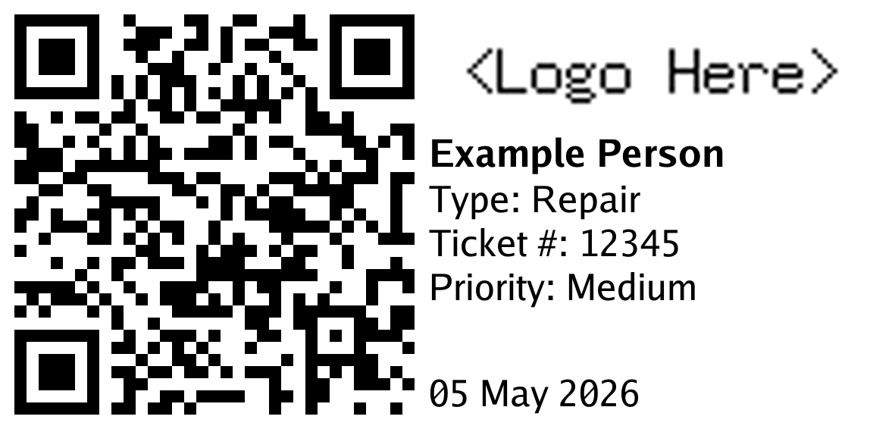

# freshservice-label

Webhook service for printing Freshservice tickets on a Brother QL-820NWB. Labels use a fixed landscape layout for 62 mm continuous stock, and print jobs are queued in memory.



## 🚀 Usage

Set the required values and start the service:

```bash
WEBHOOK_TOKEN=secret \
PRINTER_ADDR=192.0.2.20 \
go run ./cmd/freshservice-label
```

Send an Advanced JSON webhook from Freshservice to `/webhook` with `Authorization: Bearer <WEBHOOK_TOKEN>`.

## ⚙️ Configuration

| Variable        | Required | Default |
| --------------- | -------- | ------- |
| `WEBHOOK_TOKEN` | Yes      |         |
| `PRINTER_ADDR`  | Yes      |         |
| `LOGO_URL`      | No       | No logo |
| `LISTEN_ADDR`   | No       | `:8080` |
| `QUEUE_DEPTH`   | No       | `10`    |
| `PRINT_TIMEOUT` | No       | `30s`   |

When `LOGO_URL` is set, the PNG is fetched once during startup and kept in memory.

## 🪝 Webhook

```json
{
    "reference": "{{ticket.id_numeric}}",
    "qr_url": "{{ticket.url}}",
    "title": "{{ticket.requester.name}}",
    "rows": [
        { "label": "Type", "value": "{{ticket.ticket_type}}" },
        { "label": "Ticket #", "value": "{{ticket.id_numeric}}" },
        { "label": "Priority", "value": "{{ticket.priority}}" }
    ],
    "footer": "{{ticket.created_at_iso | date: '%d %b %Y'}}"
}
```

Rows with an empty or missing `value` are omitted.

## 🧑‍💻 Development

```bash
mise run test
mise run lint
mise run preview
```

`mise run preview` writes `preview.png` without contacting Freshservice or a printer. Set `LOGO_URL` to include deployment branding.

## 📄 License

Licensed under the [Apache License 2.0](LICENSE).
